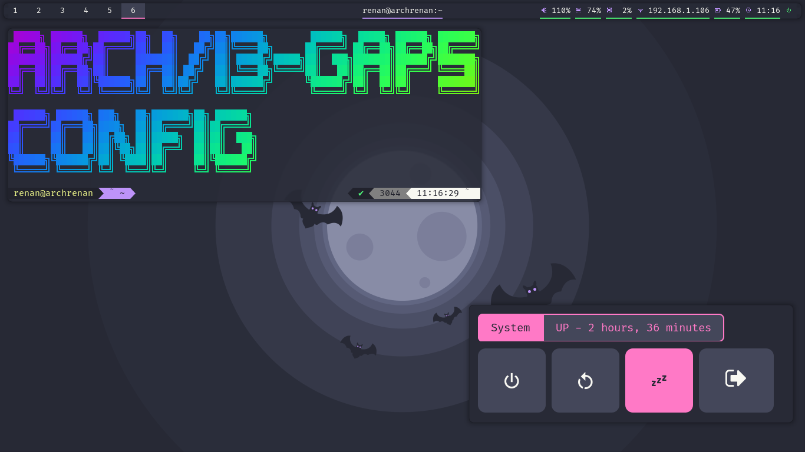

# DOTFILES

My dotfiles for Arch/i3-gaps!
## instalation

### Dont Worry!
all your the files modified/added by the script are backuped at the start!

#### Backuped files

List of backuped files/folder, **if you have any backup named the same way it will be lost!**

- ~/.config/assets.backup
- ~/.config/dunstrc.backup
- ~/.config/i3.backup   
- ~/.config/alacritty.backup 
- ~/.config/neofetch.backup
- ~/.config/nvim.backup
- ~/.config/coc.backup 
- ~/.config/picom.conf.backup
- ~/.config/polybar.backup
- ~/.config/qutebrowser.backup
- ~/.config/ranger.backup
- ~/.config/rofi.backup 
- ~/.themes.backup
- ~/.icons.backup

if you want to delete the backuped files run the deletebackups.bash script, after that all
backups (except .zshrc and .oh-my-zsh) will be gone!

### Commands

 1. `git clone https://github.com/renanbrayner/dotfiles.git ~/.dotfiles`
 2. `~/.dotfiles/setup.bash`

### Oh-my-zsh

 To setup oh-my-zsh run this **after starting a i3 session**:

 1. `~/.dotfiles/setupzsh.bash`
